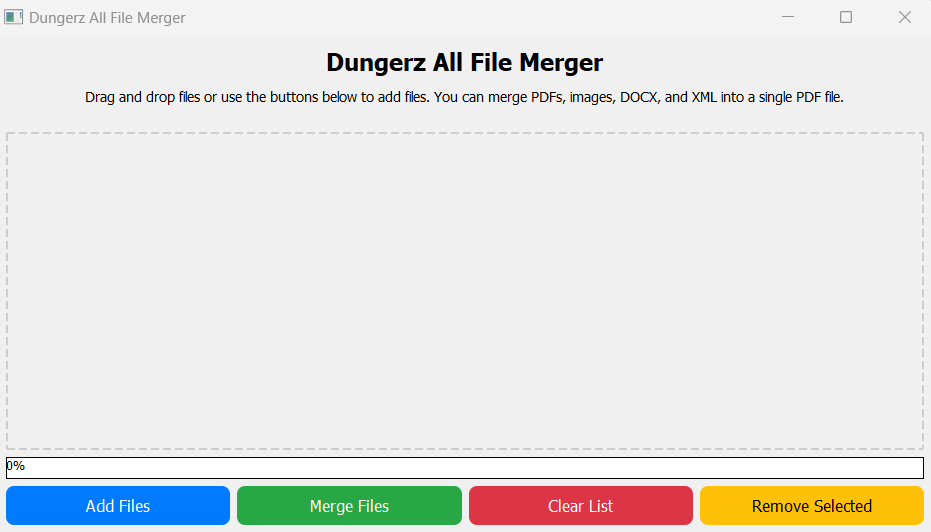

# Dungerz All File Merger


The **Dungerz All File Merger** is a versatile desktop application designed to merge PDFs, images, DOCX, and XML documents into a single PDF file. Built with PyQt5 for a user-friendly interface and leveraging PyPDF2, Pillow, python-docx, lxml, and reportlab, this application supports multiple file formats with drag-and-drop functionality and interactive file management.



## Table of Contents

- [Features](#features)
- [Installation](#installation)
- [Prerequisites](#prerequisites)
- [Setup](#setup)
- [Usage](#usage)
- [Contributing](#contributing)
- [Credits](#credits)
- [License](#license)

## Features

- **Drag-and-Drop Interface**: Easily add PDF, DOCX, XML, and image files to the application.
- **File Format Support**: Merge PDFs, images (JPG, PNG, BMP, GIF, TIFF), DOCX, and XML into a single PDF.
- **Progress Indication**: Track the merge process with a progress bar that resets after completion.
- **Simple Merging**: Combine your selected files into one PDF with a single click.
- **Interactive List Management**: Add, remove, and clear files in the list before merging.
- **Cross-Format Merging**: Support for merging a mix of file types (PDFs, DOCX, XML, images) into one PDF.

## Installation

### Prerequisites

- Python (3.6 or newer) installed on your system.
- pip (Python package installer).

### Setup

1. Clone the repository to your local machine:

    ```bash
    git clone https://github.com/Dungyy/PDF-Merger.git
    ```

2. Navigate to the cloned directory:

    ```bash
    cd Dungerz-All-File-Merger
    ```

3. Set up a virtual environment for Python packages:

    ```bash
    python -m venv env
    source env/bin/activate  # On Windows use: env\Scripts\activate
    ```

4. Install the required dependencies from the `requirements.txt` file:

    ```bash
    pip install -r requirements.txt
    ```

### Dependencies

The application uses the following libraries:
- `PyQt5`
- `PyPDF2`
- `Pillow`
- `python-docx`
- `lxml`
- `reportlab`

These will all be installed with the above command.

## Usage

To run the Dungerz All File Merger application:

1. Navigate to your project directory.
2. Execute the script:

    ```bash
    python merger.py
    ```

Once the application is launched, drag and drop PDF, DOCX, XML, and image files into the application window. Alternatively, use the "Add Files" button to browse and select files from your system. Click "Merge Files" to generate a single PDF containing all your selected documents.

## Contributing

We welcome contributions to the Dungerz All File Merger project! Please consider contributing in the following ways:

- Reporting a bug
- Discussing the current state of the code
- Submitting a fix
- Proposing new features

To contribute, fork the repository, make your changes, and submit a pull request.

## Credits

This software uses the following open-source packages:

- [PyQt5](https://riverbankcomputing.com/software/pyqt/intro)
- [PyPDF2](https://pypi.org/project/PyPDF2/)
- [Pillow](https://python-pillow.org/)
- [python-docx](https://python-docx.readthedocs.io/en/latest/)
- [lxml](https://lxml.de/)
- [ReportLab](https://www.reportlab.com/)

## License

This project is open-source and available for anyone to use at their own risk.
